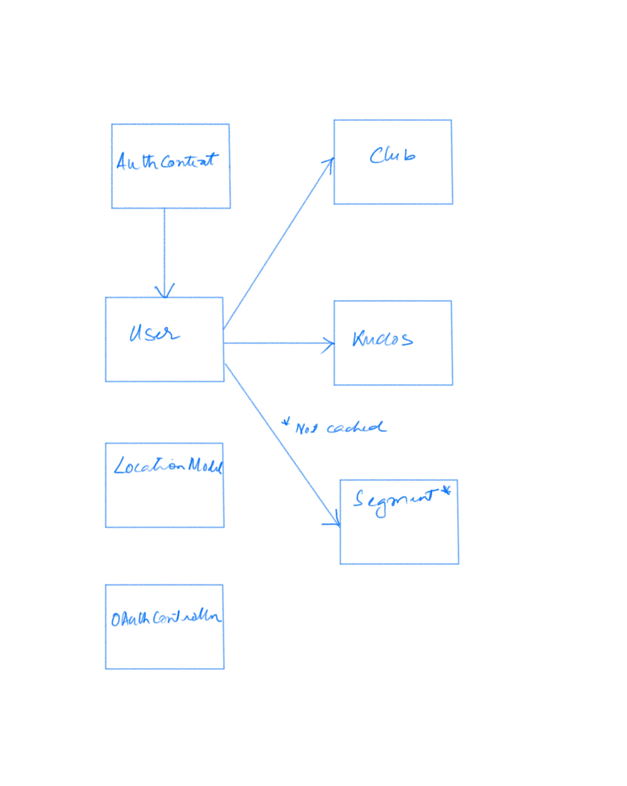

# README
## Build and Install instructions
This app has no third-party dependencies. To run the app -
1. Open `Rider.xcodeproj` in  XCode.
2. Build (Product -> Build)
3. Run (Product -> Run)

## Design Considerations
### Architecture
I picked MVC as the architecture. Given the app's simple UI, MVC seems appropriate. As we add more complex screens, we should consider using MVVM for those screens. As the navigation grows more complex we should consider adding a Co-ordinator to handle the navigation. 

### Modeling State
I use `@Observable` objects to model Application State and `@State` structs to model View State. 

Model objects and API responses are modeled separately. Despite a strong correspondence, which is to be expected, I didn’t want to couple the two tightly. The `AuthContext`, `OAuthController`, and `LocationModel` objects are the root of the model graph, and all model objects are reachable from them. 

### Error handling
The error handling strategy is to either handle errors or to make them as visible as possible while minimizing user impact.  

The app considers four types of errors. 
1. **Errors that are expected and should be handled.** An example of this is an auth error that is returned as a 401 HTTP status code by the API. The app handles that by logging out the user.
3. **Retriable API errors**. The user is given the option to retry the failed operation. 
2. **Unexpected errors that should never happen(AND it’s obvious how said errors can NEVER happen)** An example is a malformed URL. The app uses `fatalError` for this which will always trigger a crash.
2. **Unexpected errors that can dropped on the floor**. The app uses `assert` for this. The `assert` will trigger a crash in debug builds but will be a no-op(a “Hail Mary” pass) otherwise. 
## TODO
### UI Styling
1. The app UI is functional only and needs to be styled. 
2. It will be nice to show the Polyline for the segment path since the API returns this information.

### Security
1. We should store the access and refresh tokens on the phone, after encrypting them, so the user doesn’t have to go through the OAuth login flow every time they launch the app.
2. If we store tokens, we need to handle the expiration of access tokens by using the refresh token to get a new access token.
3. The Strava API Client Secret is stored in the code and needs to be obfuscated. 
### Object Model and Caching

1. All `fetch*()` methods that make API calls are in the `User` model. This works for a simple schema. As the model schema evolves, they might need to be moved to other objects. For example, the method `fetchKudos()` can be moved from `User` to `Activity`. 
1. The app caches model objects in memory but doesn’t have an invalidation strategy. We should consider moving the model objects to an encrypted persistent object store such as Realm or Swift Data. We should also have a cache invalidation strategy.

### Unit Testing and Linter
The app needs a linter and unit tests.   

### Known Issues

- A warning shows up in the run log that indicates that MapKit is making too many reverse geo-coding requests. To my knowledge, this doesn’t cause any issues with the user experience but should be looked into. 

## Attributions
I have used the following work done by others - 

1. https://www.andyibanez.com/posts/using-corelocation-with-swiftui/ Andy Ibanez demonstrates a great pattern on how to warn the user before asking them for location permissions using Core Location.
2. https://luomein.medium.com/generic-swift-oauth-2-0-in-async-way-ba53f686263f shows how to implement an OAuth 2.0 flow using ASWebAuthenticationSession

